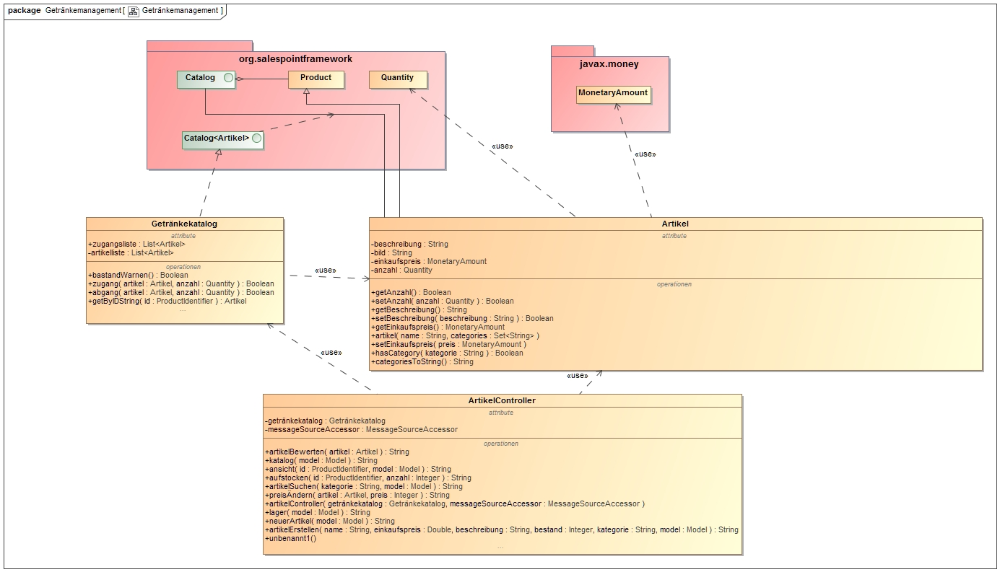
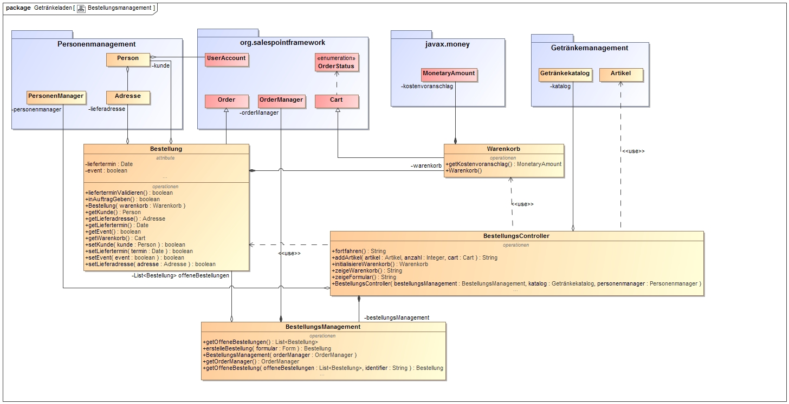
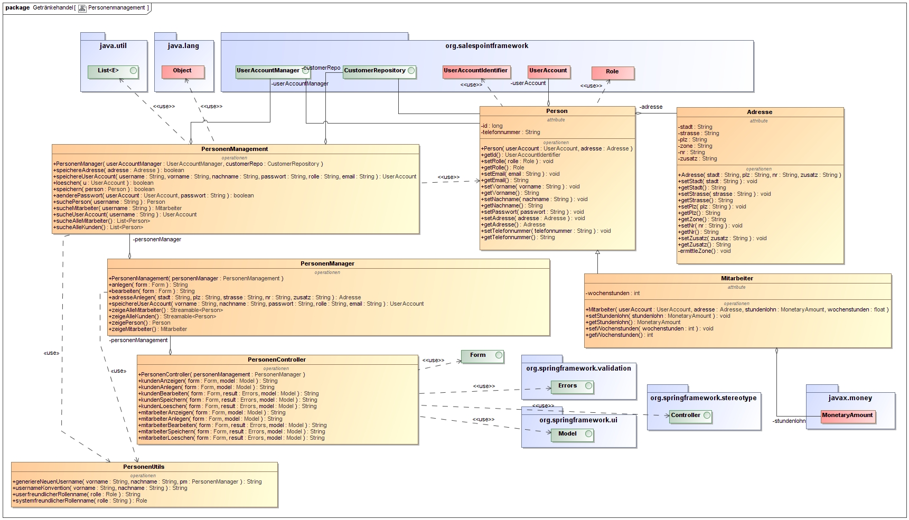
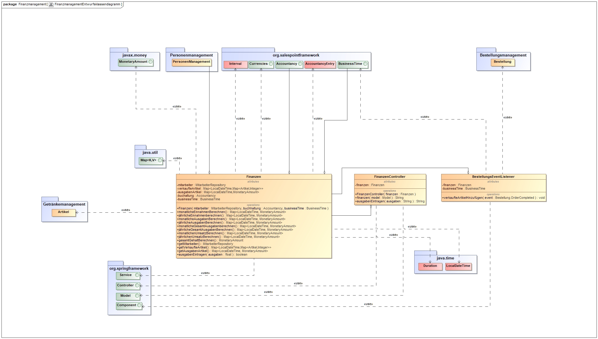
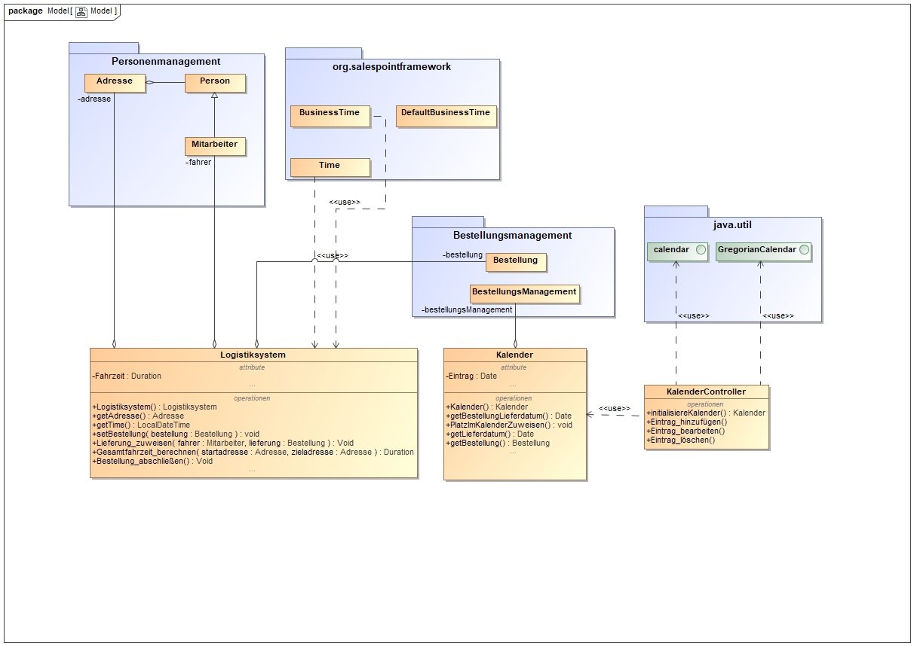

:project_name: Getränkehandel Schluck & Sohn
= Entwicklerdokumentation  __{project_name}__
:revdate: {docdatetime}
:doctype: book
:icons: font
:source-highlighter: highlightjs
:toc: left
:numbered:

== Einführung und Ziele
=== Aufgabenstellung
Im Folgenden ist der Tutor der Gruppe 15 als Auftraggeber des Projektes zu verstehen.

Der Getränkehandel beliefert nicht nur Supermärkte und kleinere Abnehmer, sondern betreibt selbst
auch eine kleine Verkaufsstelle und beliefert größere Events. Das nachträgliche Ändern oder Stornieren von Bestellungen für Großbestellungen soll nur maximal drei Tage vor dem Auslieferungstermin möglich sein. Kleine Bestellungen sind bis zum Fahrtantritt des Lieferanten stornierbar.

Neben dem bereits erwähnten Direktverkauf muss es auch möglich sein Kunden anzulegen, Kostenvoranschläge und Aufträge zu erstellen. Die Rechnungserstellung und ist ein Kann-Kriterium. Dabei sollen Kunden die Möglichkeit haben, sich auf der Website des {project_name} zum aktuellen Sortiment informieren zu können, eine Bestellung zusammenstellen und einen Liefertermin, welche dann telefonisch einem Mitarbeiter des Handels übermittelt wird.

Es soll nach bestimmten Getränken gesucht werden und durch den Einsatz von Filtern, bzw. Kategorien sich schnell einen Überblick über das Sortiment verschafft werden können. Dies gilt sowohl für Kunden, als auch für die Mitarbeiter des {project_name}.

Um die Logistik zu verwalten soll der Vorrat an Getränken einsehbar sein und das Lager nach Stückzahlen sortiert werden können.
Außerdem werden Zonen eingerichtet, in denen die entsprechenden
Abnahmestellen der Kunden liegen. Zu den Zonen sind auch die Fahrzeiten bekannt. Lieferanten des
Getränkehandel müssen am Morgen eine sinnvolle Auflistung ihrer zu beliefernden Abnehmer in
einer oder mehreren benachbarten Zonen erhalten. Außerdem sollen Zeiten berechnet werden, wie lange der jeweilige Lieferant für die Lieferungen benötigen wird. Die Liefertermine sollen in einem Kalender anschaulich dargestellt werden.

Weiterhin wird ein Kundenverzeichnis mit Kundendaten benötigt, welches von den Mitarbeitern eingesehen werden kann, um bei eventuellen Lieferschwierigkeiten auf Kontaktdaten zurückzugreifen zu können.

Der Chef ist der Administrator der Software und kann Einsicht in die Statistiken über die Auslastung des Getränkehandels und die Bestellübersicht bekommen. Das Löschen und Hinzufügen von Mitarbeiterkonten, das Aufstocken des Getränkebestandes, sowie die Änderung der Akteurzugehörigkeit einzelner Mitarbeiter (Kassierer, Lieferant, Chef) soll ebenfalls nur vom Administrator durchgeführt werden können.

Das Hauptziel des Projektes ist das Resultat, eine funktionierende, nutzerfreundliche und intuitiv zu bedienende Software zum Management des {project_name} erstellt zu haben, mit welcher der Kunde (hier Tutor der Gruppe 15) zufrieden ist. Gruppeninterne Nebenziele sind erste Kontakte mit dem Projektmanagement erfolgreich zu absolvieren und die Vertiefung der Softwareentwicklung im Großen mit Java und den Frameworks Spring und SalesPoint.

=== Qualitätsziele
Die folgende Tabelle stellt besonders wichtige Qualitätsaspekte und deren Gewichtung dar.

1 = weniger wichtig ..
5 = sehr wichtig
[options="header", cols="3h, ^1, ^1, ^1, ^1, ^1"]
|===
|Qualitätsziel            | 1 | 2 | 3 | 4 | 5
|Wartungsfreundlichkeit   |   | x |   |   |
|Erweiterbarkeit          |   |   |   | x |
|Nutzbarkeit              |   |   |   | x |
|Zuverlässigkeit          |   |   | x |   |
|Sicherheit               |   |   |   | x |
|Leistung                 | x |   |   |   |
|Benutzerfreundlichkeit   |   |   | x |   |
|===

*Wartungsfreundlichkeit:*
Auftretende Fehler sollen schnell behoben werden können.

*Erweiterbarkeit:*
Es soll möglich sein, dass das System auf Wunsch des Kunden durch Funktionalitäten erweitert werden kann.

*Nutzbarkeit:*
Alle Funktionalitäten des Systems müssen dazu dienen die Aufgabe die an das System gestellt wurde zu erfüllen.

*Zuverlässigkeit:*
Das System muss in der Lage sein Lange Zeiträume fehlerfrei zu laufen und gleichzeitig keine falschen Informationen zu produzieren.
r*Sicherheit:*
Die Daten der Nutzer des Systems dürfen nicht offen zugänglich sein. Außerdem muss vermieden werden, dass das System nicht von anderen Nutzern als vorgesehen genutzt oder sogar manipuliert erden kann.

*Leistung:*
Das System muss so aufgebaut sein, dass es mit den Möglichkeiten des Kunden so schnell wie Möglich die gewünschten Aufgaben erfüllt. Nutzer des Systems sollen auf keinen Fall spürbare Wartezeiten bei der Nutzung der Website haben.

*Benutzerfreundlichkeit:*
Das System muss so einfach wie möglich nutzbar sein.

== Randbedingungen
=== Hardware-Vorgaben
Die Platform, auf der das System läuft muss einen Zugang zum Internet haben, damit Kunden darauf zugreifen können.
Außerdem muss die Platform Java unterstützen.

=== Software-Vorgaben
Auf der Platform muss das Java RE version 1.8 und Maven 2.2 installiert sein. Außerdem müssen alle Nutzer einen Browser mit HTML 5 Unterstützung haben.

=== Vorgaben zum Betrieb der Software
Die Software läuft nach dem Starten selbstständig. Es muss eine dauerhafte Internetverbindung sichergestellt werden, um die Software nutzen zu können und damit diese selbstständig externe Schnittstellen installiert.
Es existiert nach der Installation ein vorgefertigter Account mit voller Berechtigung Name: BossHugo Passwort: 123
Dieser Account und insbesondere das Passwort müssen sofort geändert werden, damit die Sicherheit der Software gewährleistet ist.

Um Bilder zu den Artikeln hinzuzufügen müssen diese im Ordner \src\main\resources\static\resources\img\getränke als jpg Datei abgelegt werden und den Namen des Produktes tragen.

== Kontextabgrenzung
=== Externe Schnittstellen
Es werden in der Software diverse Schnittstellen verwendet. Im folgenden Abschnitt werden diese kurz erläutert und deren Notwendigkeit für das Projekt begründet.

==== Spring-Framework
Das Spring-Framework stellt wohl die meisten Schnittstellen zur Verfügung, welche unabdingbar für die Funktionalität der Software des {project_name} sind. Mit Hilfe von Spring kann die Software über den Webbrowser gesteuert werden, wobei diese auf einem Server liegt, welcher die Anfragen des Webbrowsers entgegen nimmt, verarbeitet, entsprechende HTML-Seiten generiert (dabei trägt Thymeleaf einen großen Teil bei) und diese wieder an den Client schickt. Spring übernimmt bei diesem Vorgang das Mapping dieser GET-, beziehungsweise POST-Requests und ruft benutzerdefinierte Methoden auf. Dies geschieht üblicherweise in den Controller-Methoden, welche mit dem Attribut *@Controller* ausgezeichnet sind. Darüber hinaus übernimmt Spring mit Hilfe von Hibernate auch die Aufgabe der persistenten Datenspeicherung über Programmneustarts hinaus (siehe dazu Abschnitt Entwurfsentscheidungen, Persistenz).

=== Thymeleaf
Thymeleaf ist eine server-seitige Java-Template engine. Diese nutzt vorgefertigte HTML-Templates, in denen die Thymeleaf-Syntax verwendet wurde, und füllt Platzhalter durch entsprechende Variablen. Insbesondere können ganze Tabellen durch Iteration über Listen erstellt werden, welche dem Spring-Model übergeben werden. Dies vereinfacht die statische HTML-Seitenerstellung enorm und erleichtert die Informationsweitergabe aus Java hinaus über HTML zum Webbrowser.

=== SalesPoint
Das SalesPoint-Framework bietet die eigentliche Basis für den {project_name}, da mit dessen Hilfe sogenannte points of sales (Verkaufsorte) aufgebaut werden können. Es basiert auf Spring und bietet 6 Kernmodule: accountancy, inventory, catalog, orders, business time und user accounts. Accountancy ist wichtig für die Buchführung, welche durch das Finanzmanagement realisiert wird. Inventory verwaltet die Menge der vorhandenen Produkte und der Catalog verwaltet die sich im Getränkehandel befindlichen Getränke. Diese Funktionalitäten werden vom Getränkemanagement abgedeckt. Um die Erstellung, Verwaltung und Löschung von Bestellungen kümmern sich das Bestellungsmanagement und Logistikmanagement, welche auf das SalesPoint-Modul orders zurückgreifen. Das Personenmanagement verwaltet die im System vorhandenen Kunden, welche im Getränkehandel einkaufen, sowie dessen Mitarbeiter. Das Modul user accounts dient dabei als zentrale Schnittstelle. Und zuletzt kann mit Hilfe der business time das System zu einem bestimmten Zeitpunkt gesetzt werden, um die korrekte Funktionalität dessen zu überprüfen (zum Beispiel wenn Bestellungen an einem bestimmten Tag fällig sind).

=== Java Standard-Bibliothek
Es ist fast schon ziemlich trivial bei der Entwicklung von Java-Software diese mit aufzuzählen, jedoch gehört die Java-Bibliothek auch mit erwähnt. Sie bietet die absolute Grundlage für die Entwicklung der Software des Getränkehandel. Alle oben genannten Frameworks basieren auf dieser und nutzen ihre elementare Datenstrukturen, Klassen und Interfaces.

=== GoogleCalendar
Der GoogleCalendar ist ein HTML-basierter Kalender zur Anzeige auf der Website. Mit dessen Hilfe werden die Bestellungstermine organisiert und abgearbeitet.

== Lösungsstrategie
Es folgt ein kurzer Überblick über die grundlegenden Entscheidungen und Lösungsansätze, welche im Projekt umgesetzt wurden.

=== Finanzmanagement

Um die Buchhaltung zu führen wird mit LocalDateTime die Zeit erfasst, wann zum Beispiel Artikel verkauft wurden oder wann Ausgaben getätigt wurden. Mittels dem BestellungsEventListener wird bei einer abgeschlossenen Bestellungen ein Eintrag in die Map "verkaufteArtikel" verzeichnet, welcher als Key den Zeitpunkt des Abschließens nimmt und als Value eine Map mit den verkauften Artikeln und deren Anzahl. In "buchhaltung" (Accountancy) wird automatisch ein AccountancyEntry durch einen EventListener vom SalespointFramework beim abschließens einer Order erstellt. Ausgaben, Einnahmen und Umsatz sollen in Funktionen berechnent werden, die entweder die Finanzen in  Monaten oder Jahren darstellen. Dabei wird bei den Einnahmen die Funktion "salesVolume" von Accountancy genutzt, welche die Parameter Interval und Duration benötigt. Ausgaben werden in ein Inputfeld eingegeben und in der Funktion wird die LocalDateTime mit dem Wert der Ausgaben gemappt. Um die monatlichen und jährlichen Daten zu berechnen werden Intervale genutzt, bei denen geprüft wird, in welchem Interval die jeweiligen Daten liegen.

Beim Lager werden vorallem die Funktionen vom Getränkekatalog genutzt. Der Bestand(Quantity) ist im jeweiligen Artikel zu finden.

=== Personenmanagement
Da im Getränkehandel zwei Nutzergruppen verwaltet werden sollen (die Kunden und Mitarbeiter, zusammengefasst zu Personen), müssen diese sinnvoll verwaltet werden. Dazu wird das SalesPoint-Modul user account verwendet. Dieser beinhaltet unter anderem den UserAccountManager, welcher wiederum UserAccounts erstellt, löscht und bearbeitet. UserAccounts beinhalten typische Attribute, welche benötigt werden, um Personen abzubilden, wie eine E-Mail-Adresse, einen Vor- und Nachnamen, eine Rolle, welche die Funktion des Nutzers im System abbildet, sowie einen Benutzernamen und ein Passwort zum Login auf der Website. Da aber noch weitere wichtige Attribute fehlen, wurden diese hinzugefügt, indem eine Oberklasse Person erstellt wurde, welche ein Adress-Objekt und das UserAccount-Objekt enthält. Adressen sind wichtig, um den Wohnort von Personen oder auch Lieferadressen abzubilden. Zusätzlich zu den gewöhnlichen Attributen, aus denen eine Adresse aufgebaut ist, besitzt diese auch eine Lieferzone, welche automatisch zu der Postleitzahl ermittelt wird. Jede Person hat zusätzlich noch eine Telefonnummer, um die Erreichbarkeit dieser zu gewährleisten. Die Mitarbeiter haben die Klasse Mitarbeiter, welche von Personen abgeleitet ist. Dies ist notwendig, da Mitarbeiter Stundenlohn haben und die Anzahl an Arbeitsstunden pro Woche pauschal festgelegt wird. Die Methoden des Personenmanagements dienen nun dazu, neue Kunden und Mitarbeiter anzulegen, zu bearbeiten, ihnen Rollen zuzuweisen (ROLE_Kunde, ROLE_Lieferant, ROLE_Kassierer und ROLE_Chef) und den Login von Mitarbeitern zu ermöglichen. Kunden und Mitarbeiter können auch wieder gelöscht werden. Parallel zu diesen Operationen werden die entsprechenden Entitäten (Person, Mitarbeiter, UserAccount und Adresse) in der Datenbank persistent an ihre Instanzen angepasst. Diese Aufgabe übernehmen das Spring-Framework und Hibernate.

=== Bestellungsmanagement
Das Bestellungsmanagement beschäftigt sich mit der Erstellung/Bearbeitung und dem Löschen der einzelnen Bestellungen. Die Klasse "Bestellung" basiert dabei auf der Salespoint eigenen "Order" und erweitert diese um ein Lieferdatum, einer Lieferadresse vom Typ "Adresse", einen Kunden des Typs "Person" und einen boolean, der entscheidet ob es sich um eine Eventbestellung handelt oder nicht. Das Lieferdatum ist dabei vom Typ "Date" und stammt aus dem Package "java.util". Die Klasse Bestellungsmanagement bewerkstelligt dabei die Speicherung und nutzt einen OrderManager von Salespoint um bereits abgeschlossene und sich im Auftrag befindliche Bestellungen zu sammeln. Offene Bestellungen werden derweile in einer Extra Liste "offene Bestellungen" gespeichert, was es einfacher macht darauf zuzugreifen. Wenn eine Bestellung erstellt wird, wird sie automatisch als "OFFEN" angesehen und wird dieser Liste zugefügt. Der BestellungsController muss 2 verschiedene Seiten bearbeiten. Zum einen das "Formular" in dem der Kassierer eine neue Bestellung aus einem Warenkorb erstellen kann und den Warenkorb an sich. Somit muss der Controller also auch dem Warenkorb verschiedene Artikel hinzufügen können. Der Warenkorb basiert auf Grundlage des vom Salespoint vorgegebenen "Cart". Jedoch unterscheidet sich der Warenkorb in dem Monetary Amount "kostenvoranschlag" der eine Summe der im Warenkorb befindlichen Artikel darstellt. Dazu ist auch die Klasse "MonetaryAmount" von javax.money notwendig. Durch die genannten Funktionalitäten ist also auch eine enge Zusammenarbeit mit den Packages "Personenmanagement" und "Getränkemanagement" notwendig.

=== Getränkemanagement
Das Getränkemanagement ist grundsätzlich um die Klasse Artikel, die die zu verkaufenden Getränke o.ä. abbildet und den Getränkekatalog, der alle Artikel, die sich im Sortiment befinden zusammenfasst und verwaltet, aufgebaut.

Die Klasse Artikel erbt ihre Grundfunktionen und Struktur von der Klasse Product aus dem SalesPoint Framework. Sie erweitert diese jedoch um Attribute, wie z.B. die Anzahl, eine Quantity aus SalesPoint und den Einkaufspreis, eine MonetaryAmount aus javax.money und einige Funktionen zur Ein- und Ausgabe.
Für die Zwecke des Getränkehandels wurde keine Notwendigkeit darin gesehen, zwischen Product und InventoryItem zu unterscheiden, was dazu führt, die Anzahl im Artikel selbst zu behalten, um Komplexität und damit auch Rechenzeit zu sparen. Dies kommt besonders bei einem großen Sortiment zum tragen.

Der Getränkekatalog erweitert nicht, wie üblich, das SalesPoint Interface Catalog<Artikel> sondern implementiert es. Diese Entscheidung ist Notwendig, da dem Getränkekatalog viele Operationen zur Verwaltung hinzugefügt werden mussten. Außerdem wurde das Attribut "zugangsliste" hinzugefügt, um eine einfache Struktur zur Berechnung der Ausgaben für das Finanzmanagement bereit zu stellen.

Als Adapter zwischen dem Java Back-End des Getränkemanagements und den HTML Diensten dient die Klasse ArtikelController. Dieser Controller verarbeitet alle direkten Anfragen an das Getränkemanagement.

== Bausteinsicht
=== Packagediagramm
image::.\models\analysis\Packegediagramm.jpg[Landing page, 50%, 50%, pdfwidth=50%, title= "Packegediagramm", align=left]

==== Erklärung
Packagediagramm Erklärung

===== Package Getränkehandel

Dieses Package ist das Sammelpackage für alle Teilbereiche des Endprodukts, die ebenfalls in Form von Packages realisiert wurden.

===== Package Bestellungsmanagement:

nutzt :

 	- Getränkemanagement
	- Mitarbeitermanagement

importiert :

	- javax.money
	- java.util
	- org.salespoint
	- springframework

Bestellungsmanagement braucht eine Liste von Artikeln (Getränkemanagement), eine Kundenliste (Personen- / Mitarbeitermanagement) und importiert neben
den dazu erforderlichen Listen aus java.util ebenfalls OrderManager, Order, Cart, ... aus Salespoint. Fьr einen Kostenvoranschlag des Warenkorbs ist ebenfalls
ein MonetaryAmount aus javax.money notwendig. Natьrlich wird dabei auch das Spring Framework verwendet.

===== Package Getränkemanagement

nutzt :

 	- Mitarbeitermanagement

importiert :

	 - javax.money
	 - org.salespoint
	 - java.util
	 - springframework

Neben einer Zugangsliste (java.util) und den anderen zur Erstellung und Verwaltung notwendigen Komponenten des Salespoint Frameworks braucht auch das Getränkemanagement
einen Preis für jeden Artikel des Typs MonetaryAmount. (javax.money) Außerdem wird mit verschiedenen Visibilities gearbeitet, wofür die Rolle einer Person abgefragt werden
muss (Personen- / Mitarbeitermanagement & Spring).

===== Package Finanzmanagement

nutzt :

	-  Getränkemanagement
	-  Bestellungsmanagement
	-  Mitarbeitermanagement

importiert :

	- org.salespoint
	- javax.money
	- springframework
	- java.util
	- java.time

Das Finanzmanagement führt alle Mitarbeiter, offene und bearbeitete Bestellungen sowie einen Überblick zum aktuellen Lagerstand auf. (Getränke-/Mitarbeiter-/Bestellungsmanagement)
Dazu arbeitet es mit Listen (java.util) MonetaryAmounts (javax.money) und den üblichen Spring Funktionalitäten.

===== Package Mitarbeitermanagement

nutzt :

-

importiert :

	- springframework
	- org.salespoint

Das Mitarbeitermanagement stellt eine Liste von den Mitarbeitern auf und legt ihre Attribute fest.
Dazu arbeitet es mit Listen (java.util) und den üblichen Spring Funktionalitäten.

===== Package Logistikmanagement

nutzt :

	- Bestellungsmanagement
	- Mitarbeitermanagement

importiert :

	- SpringFramework
	- org.salespoint

Das Logistikmanagement stellt einen Kalender (java.util.calendar) mit Bestellungen (aus Bestellungmanagement) zusammen, außerdem
werden Lieferungen einem Fahrer zugewiesen (Mitarbeitermanagement).

== Entwurfsentscheidungen
=== Architektur

Es gibt vier Klassen/Akteure, die mit dem System interagieren. Kunde, Chef, Kassierer und Lieferant.
Der Kunde hat Zugriff auf den Katalog
und nach einer Produktauswahl kann er zu dem Warenkorb übergehen und seine Auswahl bestätigen.
Dadurch wird eine Bestellung erstellt, die von dem Kassierer überarbeitet werden kann. Die Kundendaten
werden in eine Kundenliste vom Kassierer gespeichert. Der Kunde wird registriert.
Im System wird die Bestellung zu einem Auftrag, welcher zum Teil einer Auftragsliste wird.
Diese Auftragsliste wird von dem Fahrer eingesehen. Der Fahrer wählt die Aufträge zum Fahren aus.
Eine Lieferung erfolgt.
Der Kassierer ist außerdem ermächtig die Kundendaten und die Bestellungen zu bearbeiten.
Alle Angestellten sind in einer Angestelltenliste vermerkt und ist von dem Chef
einsehbar und bearbeitbar. Der Chef hat Zugriff zu allen Funktionalitäten und zusätzlich zu den Statistiken des Getränkeladens.

=== Verwendete Muster
=== Persistenz
Um angelegte Daten, wie zum Beispiel Kunden, Mitarbeiter, Lagerbestände, insbesondere auch Getränke und Finanzen des {project_name} persistent über Softwareneustarts zu speichern, wird die Java Persistence API (JPA) in Verbindung mit dem Spring-Framework und Hibernate verwendet. Intern arbeitet die Software mit einer relationalen Datenbank, wobei Klassen einzelne Entitäten darstellen und eindeutige IDs (Primärschlüssel in der Datenbank) besitzen. Entitäten und Relationen zwischen Klassen (und letztendlich Objekten) werden im Quellcode durch Annotationen definiert (zum Beispiel *@Entity*, *@OneToMany*, *@ManyToOne* und *@OneToOne*). Das Spring-Framework nimmt den Entwicklern die Arbeit mit der Datenbank weitestgehend ab. Änderungen an Objekten, welche aus der Datenbank geholt wurden, werden mit Attributänderung automatisch aktualisiert und persistent gespeichert.

=== Benutzeroberfläche
Die Software wird durch den Webbrowser bedient. Es gibt ein zentrales Menü, welches sich horizontal im oberen Bereich auf der Website befindet, mit dessen Hilfe man schnell die grundlegenden Funktionen der Software nutzen kann und die Navigation über diese schnell ablaufen kann. Da die Benutzeroberfläche ein modernes Design erhalten soll und nicht zu viel Zeit mit der Arbeit an CSS3 und HTML5 verbracht werden soll, wird das HTML-Framework Bootstrap verwendet.

== Entwurfsklassendiagramme
Es folgen die Entwurfsklassendiagramme der Entwurfs- und Implementierungsphase.

=== Getränkemanagement

=== Bestellungsmanagement

=== Personenmanagement

=== Finanzmanagement

=== Logistikmanagement

[appendix]
== Glossar

[appendix]
== Frameworks
link:https://spring.io/[Spring]

link:http://www.thymeleaf.org/[Thymeleaf]

link:https://st.inf.tu-dresden.de/SalesPoint/[Salespoint]

link:https://docs.oracle.com/javase/8/docs/api/overview-summary.html[Java 8 - Documentation]

link:https://google.de/[GoogleCalendar]
