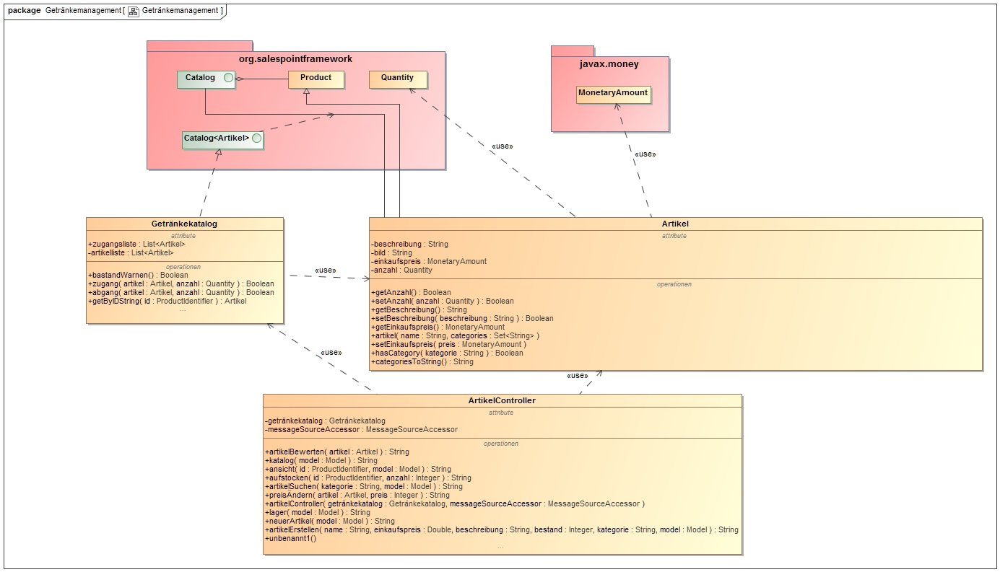
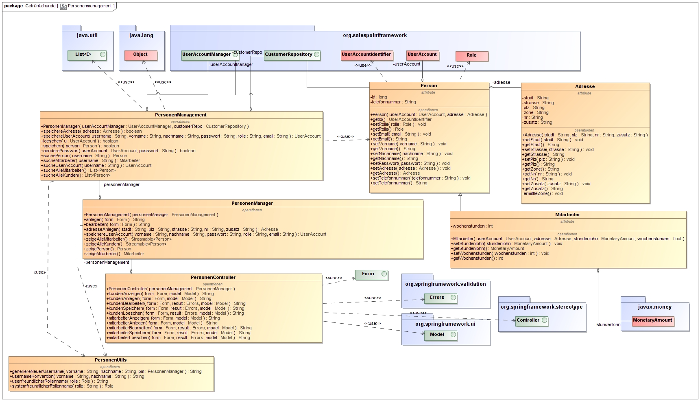
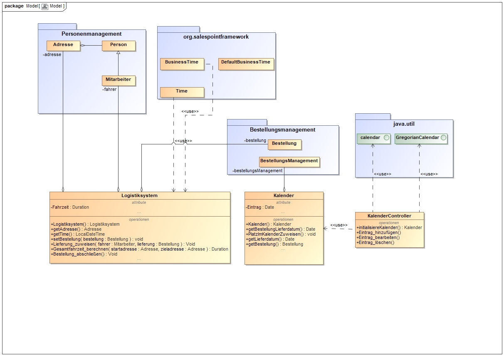

= Artefaktsammlung der Entwurfsphase

In diesem Ordner liegen alle in der Entwurfsphase erstellten Diagramme als Bild und zusätzlich das zugrundeliegendes Modell.

== Entwurfsklassendiagramme
=== Getränkemanagement

=== Bestellungsmanagement

image::EntwurfsklassendiagrammMarcus.jpg[Landing page, 100%, 100%, pdfwidth=50%, title= "Entwurfsklassendiagramm \"Bestellungsmanagement\" von Marcus", align=left]

=== Personenmanagement

=== Finanzmanagement

image::EntwurfsklassendiagrammAn.jpg[Landing page, 100%, 100%, pdfwidth=50%, title= "Entwurfsklassendiagramm \"Finanzmanagement\" von An", align=left]

=== Logistikmanagement

## Quicklinks
* link:EntwurfsklassendiagrammLeon.mdzip[Entwurfsklassendiagramm "Getränkemanagement" von Leon]
* link:EntwurfsklassendiagrammMarcus.mdzip[Entwurfsklassendiagramm "Bestellungsmanagement" von Marcus]
* link:EntwurfsklassendiagrammTony.mdzip[Entwurfsklassendiagramm "Personenmanagement" von Tony]
* link:EntwurfsklassendiagrammAn.mdzip[Entwurfsklassendiagramm "Finanzmanagement" von An]
* link:EntwurfsklassendiagrammPavel.mdzip[Entwurfsklassendiagramm "Logistikmanagement" von Pavel]
